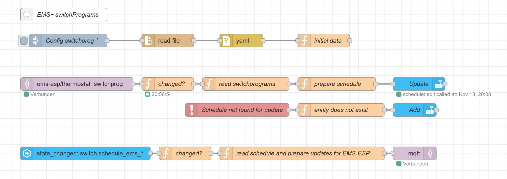
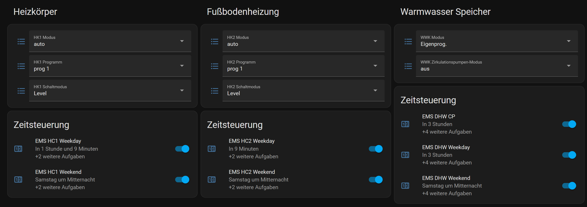
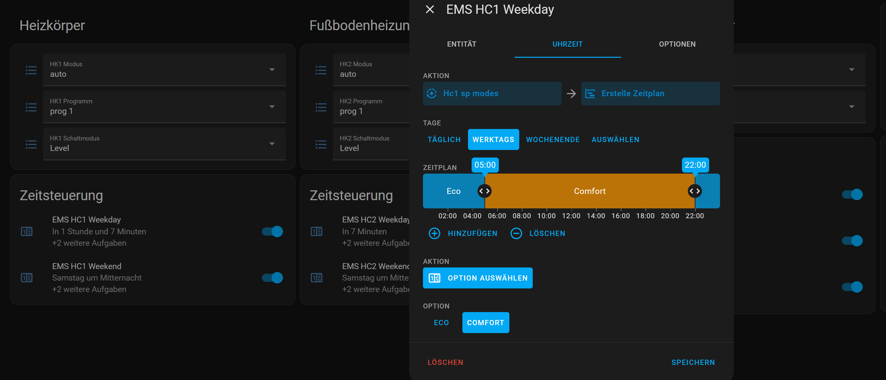

This node-red flow is able to read and write EMS+ switchPrograms from the ems-esp gateway.

The required ems-esp firmware is in beta testing status and can be downloaded from:
https://github.com/MichaelDvP/EMS-ESP32/releases  (please use the test builds)

EMS+ thermostats (e.g. RC310) have different switchPrograms for each heating circuits (select.thermostat_hc1_program)
and each program can be changed for different modes.
The entity select.thermostat_hc1_switchprogmode might be available for doing this. 
The modes "Level" or "Absolute" can be selected. 
"Level" defines switch between "eco" and "comfort" and "Absolute" defines temneratures. 

The combination of active program and switchprogmode defines the switchProgram read for each heating circuit.
DHW (warm water buffer and circulation pump) have only "Levels".

The testbuild creates in the mqtt broker a topic ems-esp/switchprog wich contains all switchPrograms within one JSON.
Home Assistant Discovery is not available. This flow creates HA schedules and lovelace cards to edit the thermostat time programs.
The HACS components scheduler-component and scheduler-card are used for this.

This version allows to select schedules for "daily" "workday" or "weekend".
Different schedules for each day are not supported. 

***

The following technical prerequisites are needed: (before loading the node-red flow)

1.	HA Node-Red addon is installed in HA and active.

2.	MQTT Broker is installed and a mqtt server is defined in node-red connecting to broker using the mqtt node.

3.	The home assistant community store HACS is installed: https://www.hacs.xyz/docs/use/download/download/

4.	Install from HACS the scheduler-component and the lovelace scheduler-card:  https://github.com/nielsfaber/scheduler-component

5.  The flow needs input_number and input_select entities to be defined in configuration.yaml
    Add the following lines: 
    - input_number: !include input_number.yaml
    - input_select: !include input_select.yaml
    
    and copy (and adjust) the yaml files into the ha homeassistant (config) directory.

6.  copy the switchprog.yaml file. This file consists of schedule parameters and names for the schedules.
    Whenever the names are changed, the old schedules need to be deleted manually.

***

When all this these prerequisites 1-6 are done, then zhe flow can be imported from flownr.txt
You then need to adjust homeassistant and mqtt broker/server data.

***

Flow Logic:

Once on start the switchprog.yaml file is read and global variables are set.

Every minute the topic ems-esp/switchprog is updated and then read.
Whenever changed all schedules are updated by creating the scheduler switch entities with options for the schedule.
This can be used for the lovelace cards which are in lovelace.txt. Please adjust the titles to your needs.

Whenever the scheduler data is changed then the JSON-structure for the switchprogram is updated and send back to ems-esp

****
NR Flow:

View on lovelace:

